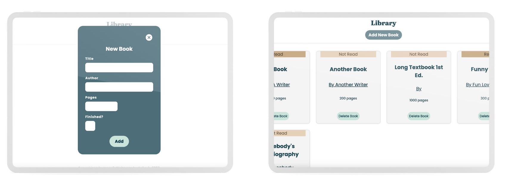

# odin-library
## The Odin Project: Library
 
  

    
  

 

## Summary 
This project is a desktop-browser-based library application built using JavaScript, CSS, and HTML. The primary objectives are to demonstrate knowledge of JavaScript Objects, Object Constructors, Object Prototypes, and JavaScript Classes. 

Detailed lessons on these concepts can be found at [The Odin Project - Objects and Constructors](https://www.theodinproject.com/lessons/node-path-javascript-objects-and-object-constructors) and [The Odin Project - Classes](https://www.theodinproject.com/lessons/node-path-javascript-classes#practice).

## Key Project Instructions:

### Phase 1: Using Object Constructor and Prototype

Using Object Constructor and Prototype: 

  1. Store newly-created book objects in an array.
  2. Populate this array with user book entries. 
  3. Display all book entries in a structured format (e.g., table or card).
  4. Implement a "NEW BOOK" button to capture book details.
  5. Manage book entries with options to delete or toggle the read status.

### Phase 2: Refactoring with Classes
Refactor the components created in Phase 1 using JavaScript Classes.

## Skills Acquired & Applied:
This project offered an opportunity to apply new skills and reinforce ones previously learned:

　
  
 Problem Solving 

  - Recognize problems
  - Plan solutions
  - Apply divide and conquer strategy

　
  
 Error Correction 

  
- Utilize Chrome Developer Tools
- Research solutions online 

　
  
 Clean Code Writing 

  
- Maintain consistent indentation
- Adopt descriptive naming conventions
- Practice the Single Source Of Truth principle

　
  
 HTML 

- 🆕 Implement template elements
- Construct basic forms 
- Implement client-side form validations

　
  
 CSS 

- 🆕 Utilize 'repeat(auto-fill, minmax())'
- 🆕 Combine Grid and Flexbox for layouts
- 🆕 Design with grid-template-areas
- 🆕 Style checkboxes
- 🆕 Set font sizes using clamp()
- Apply 'position: sticky' within Grid
- Implement CSS resets
- Incorporate custom fonts
- Apply advanced styling properties
- Employ parent-child combinators
- Use pseudo and attribute selectors
- Prioritize relative units 
- Define and utilize custom properties

  
 Javascript 

- 🆕 Construct classes
- 🆕 Implement Getter/Setter methods
- 🆕 Apply static keyword
- 🆕 Work with Object constructors and prototypes
- 🆕 Utilize FormData() and associated methods
- 🆕 Distinguish between this and e.target 
- 🆕 Reset forms and prevent default actions
- 🆕 Toggle booleans using logical NOT (`!`)
- Apply ternary operators
- Create and manipulate objects 
- Distinguish between function declarations and expressions
- Understand various data types
- Implement conditionals, methods, loops, and functions  

  
  
 DOM Manipulation 

 
- 🆕 Manage classes with classList method
- Apply appendChild() 
- Modify styles and html content
- Build eventListeners
- Use template literals

　
  
 Emmet 

- Write HTML using abbreviations
- Apply shortcut keys for efficiency

　
  
 SVG 

- Incorporate SVG images into designs

　
  
 Git 

- Manage code with branching and merging

 

*** 

### Resources Used 

- google-webfonts-helper by [Mario Ranftl](https://gwfh.mranftl.com/fonts)
- UI Designing Tool by [Figma.com](https://www.figma.com)
- ButtonBuddy by [5t3ph](https://buttonbuddy.dev/)
- Tint & Shade Generator by [maketintsandshades.com](https://maketintsandshades.com/)
- World's Best SVG Compressor by[vecta.io](https://vecta.io/nano)
- Icons, illustrations, photos, music, and design tools by [ICONS8](https://icons8.com/)
- Simple Responsive Font Size Calculator by [The Admin Bar](https://theadminbar.com/simple-responsive-font-size-calculator/)

### Referenced Tutorials

HTML related:

- ['The Content Template element' by MDN](https://developer.mozilla.org/en-US/docs/Web/HTML/Element/template#avoiding_documentfragment_pitfall)

- ['HTML <template> Tag' by w3schools](https://www.w3schools.com/tags/tag_template.asp)

- ['Template element' by JavaScript.Info](https://javascript.info/template-element)

Javascript and DOM related:

- ['Constructing the Object Model' by web.dev](https://web.dev/critical-rendering-path-constructing-the-object-model/)

- ['Manipulating documents' by MDN](https://developer.mozilla.org/en-US/docs/Learn/JavaScript/Client-side_web_APIs/Manipulating_documents)

- ['Handling Forms with Vanilla Javascript' by Matias Hernández](https://matiashernandez.dev/blog/post/handling-forms-with-vanilla-javascript)

- ['FormData: FormData() constructor' by MDN](https://developer.mozilla.org/en-US/docs/Web/API/FormData/FormData)

- ['What is a formData Object in JavaScript?' by educative](https://www.educative.io/answers/what-is-a-formdata-object-in-javascript)

- ['JavaScript Object.fromEntries()' by Samantha Ming](https://www.samanthaming.com/tidbits/90-object-from-entries/)

- ['Object.entries()' by MDN](https://developer.mozilla.org/en-US/docs/Web/JavaScript/Reference/Global_Objects/Object/entries)

- ['FormData: get() method' by MDN](https://developer.mozilla.org/en-US/docs/Web/API/FormData/get)

- ['How to reset or clear a form using JavaScript?' by tutorialspoint](https://www.tutorialspoint.com/How-to-reset-or-clear-a-form-using-JavaScript)

- ['JavaScript cloneNode' by JavaScript Tutorial](https://www.javascripttutorial.net/javascript-dom/javascript-clonenode/)

- ['Must-Know e.target in JavaScript Explained - Get Clicked Parent Element Using e.target' by SoftAuthor](https://softauthor.com/e-target-in-javascript/#get-clicked-parent-element-using-e-target)

- ['The JavaScript this Keyword' by w3schools](https://www.w3schools.com/js/js_this.asp )

- ['Using data attributes' by MDN](https://developer.mozilla.org/en-US/docs/Learn/HTML/Howto/Use_data_attributes)

- ['Remove Object from an Array by its Value in JavaScript' by Borislav Hadzhiev](https://bobbyhadz.com/blog/javascript-remove-object-from-array-by-value)

- ['Add CSS Class To An HTML Element Dynamically Using JavaScript' by SoftAuthor](https://softauthor.com/add-css-class-html-element-dynamically-javascript/)

- ['HTML class Attribute' by w3schools](https://www.w3schools.com/tags/att_class.asp#:~:text=The%20class%20attribute%20specifies%20one,elements%20with%20a%20specified%20class.)

- ['Element: classList property' by MDN](https://developer.mozilla.org/en-US/docs/Web/API/Element/classList)

- ['How to prevent buttons from causing a form to submit with HTML' by Go Make Things](https://gomakethings.com/how-to-prevent-buttons-from-causing-a-form-to-submit-with-html/)

- ['Element: closest() method' by MDN](https://developer.mozilla.org/en-US/docs/Web/API/Element/closest)

- ['Practical Use Cases for JavaScript’s closest() Method' by CSS-TRICKS](https://css-tricks.com/practical-use-cases-for-javascripts-closest-method/)

- ['Increment (++) / How To Use JavaScript Unary Operators' by DigitalOcean](https://www.digitalocean.com/community/tutorials/javascript-unary-operators-simple-and-useful#increment)

- ['How to use JavaScript Static Variable – Complete Guide' by ITSOURCECODE](https://itsourcecode.com/javascript-tutorial/how-to-use-javascript-static-variable-complete-guide/)

- ['How to Toggle a Boolean in JavaScript' by Borislav Hadzhiev](https://bobbyhadz.com/blog/javascript-toggle-boolean)

- ['why should not use getters/setters? #1880' on GitHub](https://github.com/airbnb/javascript/issues/1880#issuecomment-479558139)

- ['Getters/Setters vs. Regular Functions' by ChatGPT4(answer from my question)](https://chat.openai.com/share/9dd30319-0092-44fb-b3c8-9f71094d467c)

CSS related:
 
- ['How TO - Popup Form' by w3schools](https://www.w3schools.com/howto/howto_js_popup_form.asp)

- ['The Best Google Font Pairings for 2023' by Leadpages](https://www.leadpages.com/blog/best-google-fonts)

- ['grid-template-rows: max-content' by CSS-TRICKS](https://css-tricks.com/almanac/properties/g/grid-template-rows/#aa-max-content)

- ['clamp() Is The Answer To Our Fluid Typography Woes' by matcha.fyi](https://matcha.fyi/css-clamp/)

- ['Align image and text in the middle of button element' by stackoverflow](https://stackoverflow.com/questions/9420642/align-image-and-text-in-the-middle-of-button-element)

- ['CSS Box Shadow Bottom Only' by geeksforgeeks](https://www.geeksforgeeks.org/css-box-shadow-bottom-only/)

- ['Styling checkboxes and radio buttons' by MDN](https://developer.mozilla.org/en-US/docs/Learn/Forms/Advanced_form_styling#styling_checkboxes_and_radio_buttons)

- ['Preventing a Grid Blowout' by CSS-TRICKS](https://css-tricks.com/preventing-a-grid-blowout/)
